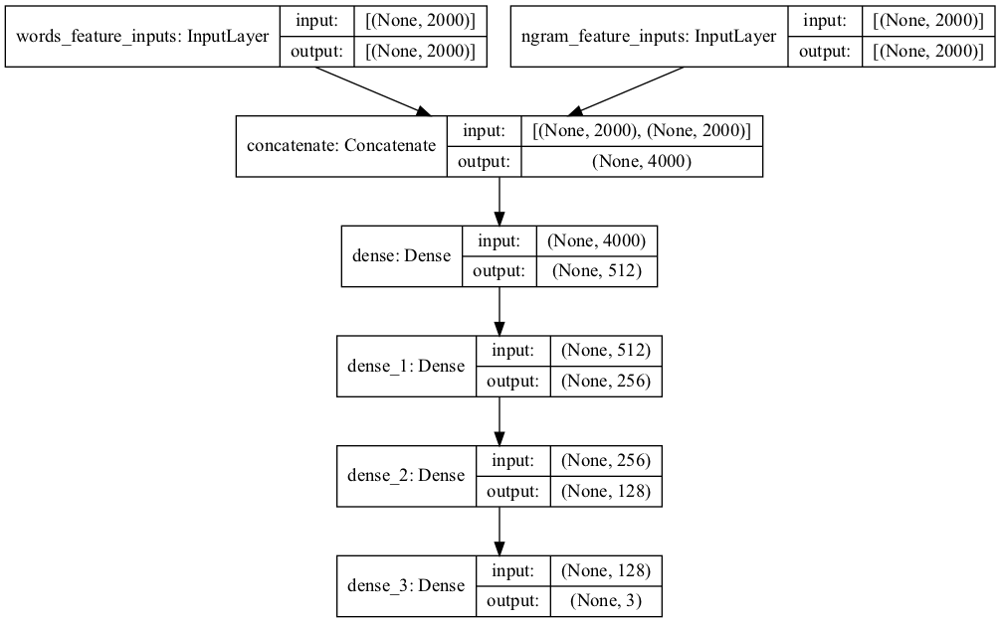

# Language Identification using Deep Neural Networks
This is an implementation of a deep neural network for the task of text language identification. The neural network architecture was built and trained using the Keras library for Python. 

## The dataset
This implementation uses the Language Identification dataset [1] which consists of 22,000 sentences for 22 different languages. Sentences in the dataset are equally divided between the languages with 1000 sentences for each language. In the experiments, two subsets of these languages were used to test the accuracy of the model. The first contains three languages from different alphabet groups namely English, Hindi and Arabic. The second includes three languages from the same alphabet group namely Portuguese, Romanian and Spanish. In the following section, these groups are referred to as dif_group and same_group respectively. These groups were selected to highlight the properties of the model as explained in the experiments and results section.

## The features
Sentences were statistically analyzed to extract two bags of features. For the first bag of features, the 2000 most frequent words were identified and sentences were assigned numerical vectors to reflect the number of occurrences of these words in each sentence. This generates a vector of length 2000 for each sentence in the dataset. In the second bag of features, the 2000 most frequent n-grams in the range [1, 4] were used. These two sets of features were concatenated to generate numerical vectors of length 4000 for each sentence. To improve convergence, values of these vectors were normalized to be between 0 and 1 before passing them to the model. 

## The model
The model is a deep neural network consists of an input layer (concatenation of two inputs), three hidden layers and an output layer with softmax activation. Figure 1 shows the architecture of the model. Feature vectors of sentence from dif_group and same_group are passed separately as input to the model. The output layer calculates the probability distributions of each sentence over the target languages (three languages for each group). Sentences are then mapped to the language with the maximum probability. 

Figure 1: The architecture of the proposed model.

## Experiments and results
As explained earlier, two groups each with three languages were used to train and evaluate the model. For each group, corresponding sentences were extracted from the dataset and divided into training (80%) and testing (20%) sets. Training sets were used to train the model and testing sets were used for evaluation. For each group, the model was trained for 40 epochs using a batch size of 256. The model achieved an accuracy of **0.998%** when tested on sentences of the dif_group and an accuracy of **0.772%** using sentences of the same_group. This is mainly due to the nature of the used bag of features where most frequent n-grams are counted to generate the representations. Sentences of languages that are from different alphabet groups have widely different vector representations and rarely share the same n-grams. This enables the model to effectively learn distinguishing features from the representations of these sentences. On the other hand, sentences of languages from the same alphabet are expected to have similar feature vectors since they share the same set of frequent n-grams. As a result, the model was not able to accurately classify the vector representations of these sentences.

## References

[1] "Language Identification dataset," [Online]. Available: https://www.kaggle.com/zarajamshaid/language-identification-datasst.

